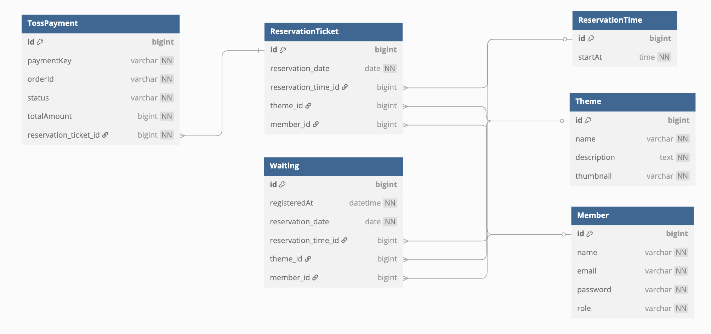

# 🚪방탕출 예약 서비스

방탈출 테마와 시간에 대해 날짜 별로 예약할 수 있는 웹 애플리케이션입니다.

현재 사용자와 관리자를 위한 다음 기능을 제공하고 있습니다.

---

## 👤 사용자 (User)

(회원가입 기능 추가 예정)

> **계정:** `user`  
> **비밀번호:** `1234`

| 기능        | 경로                                                          | 설명      |
|-----------|-------------------------------------------------------------|---------|
| 인기 테마 목록  | [/](http://localhost:8080/)                                 | 메인 페이지  |
| 예약 페이지    | [/reservation](http://localhost:8080/reservation)           | 예약 신청   |
| 나의 예약 페이지 | [/reservation-mine](http://localhost:8080/reservation-mine) | 내 예약 조회 |

## 🛠️ 관리자 (Admin)

> **계정:** `admin`  
> **비밀번호:** `1234`

| 기능        | 경로                                                            | 설명       |
|-----------|---------------------------------------------------------------|----------|
| 어드민 페이지   | [/admin](http://localhost:8080/admin)                         | 관리자 홈    |
| 테마 관리 페이지 | [/admin/theme](http://localhost:8080/admin/theme)             | 테마 추가/삭제 |
| 시간 관리 페이지 | [/admin/time](http://localhost:8080/admin/time)               | 예약 시간 설정 |
| 예약 관리 페이지 | [/admin/reservation](http://localhost:8080/admin/reservation) | 전체 예약 관리 |

---

## API 명세

Swagger를 이용하여 문서 자동화

* Swagger UI: [/docs](http://localhost:8080/docs)
* OpenAPI 명세 경로: `/v0/api-docs`

---

## Database ERD

